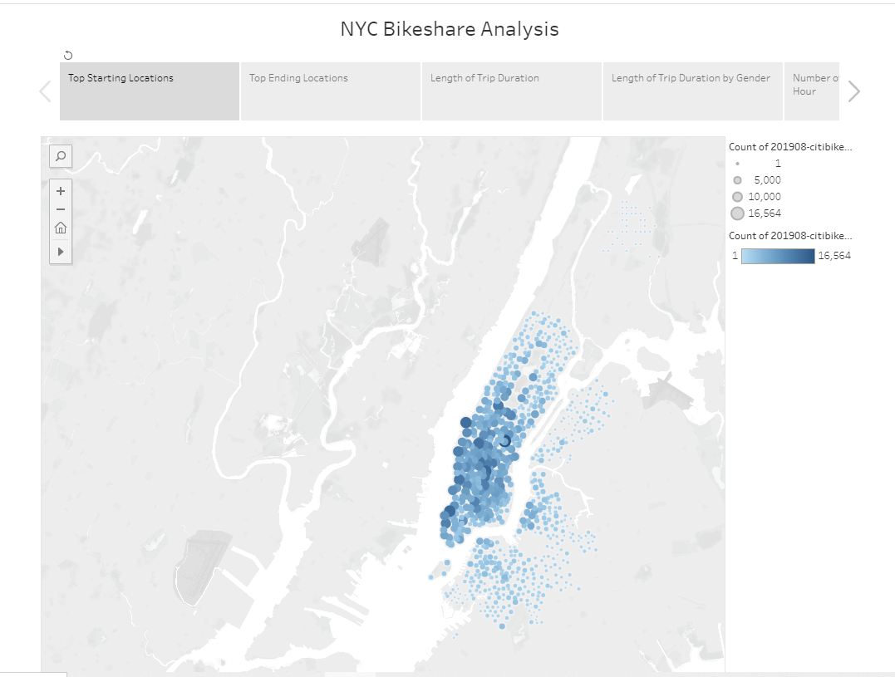
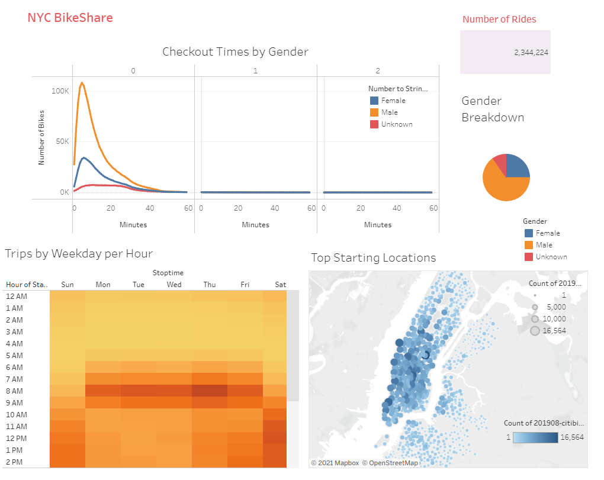
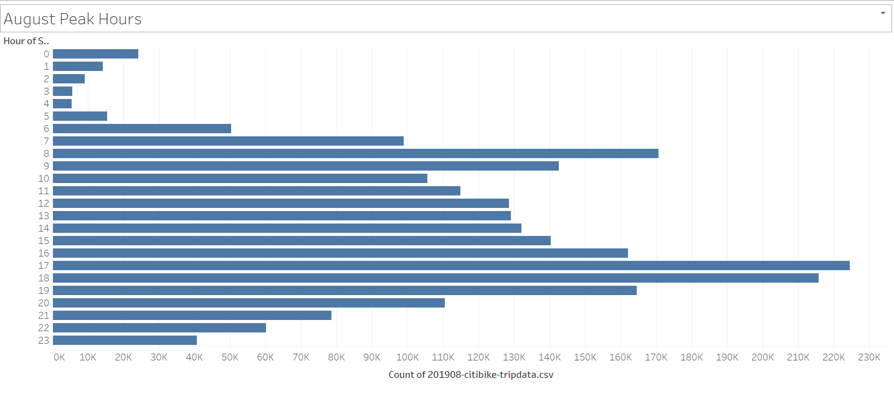
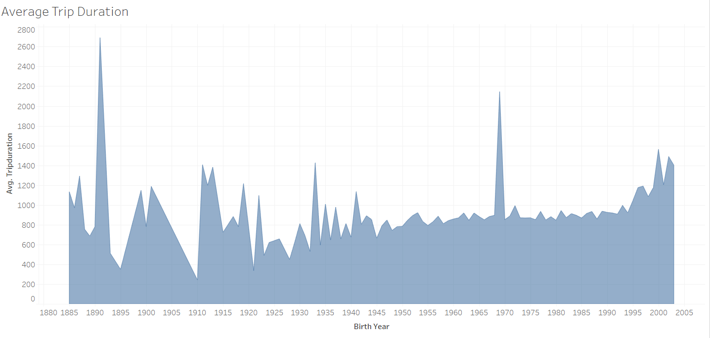
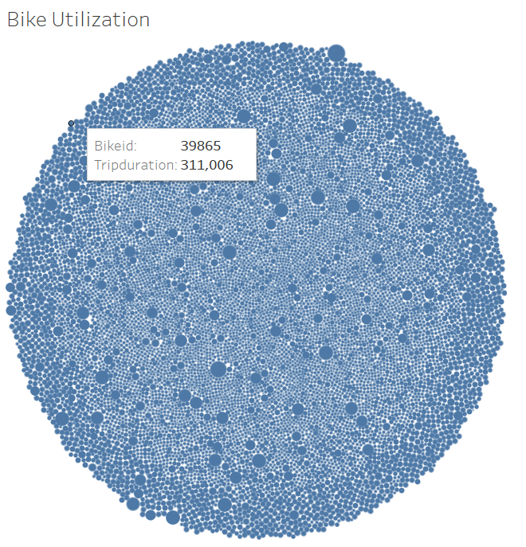
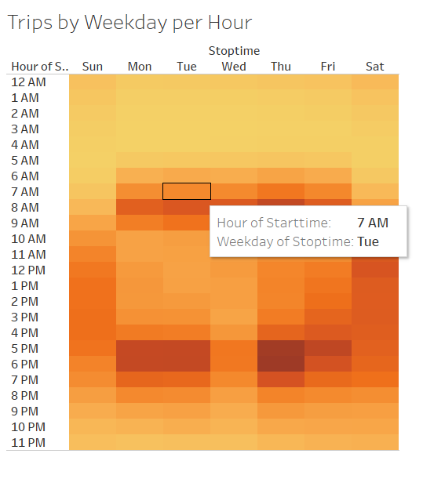
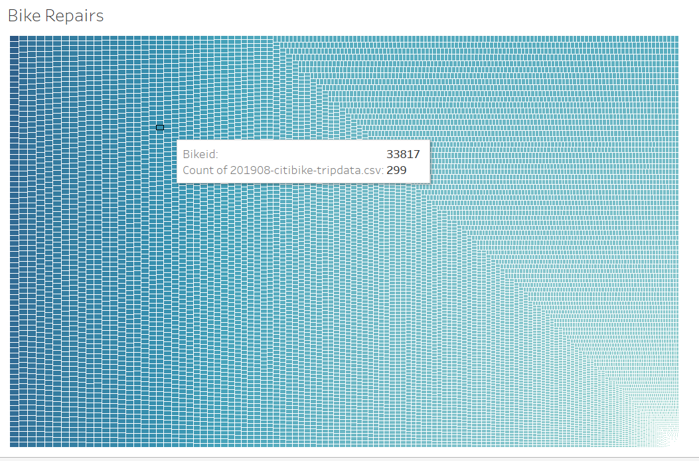
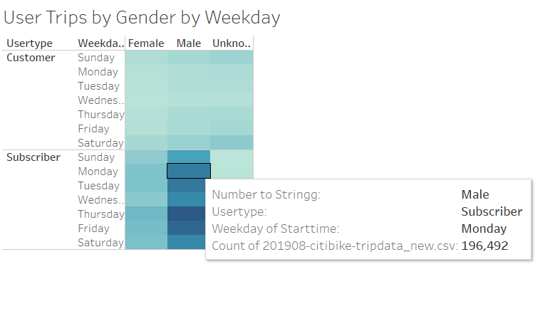
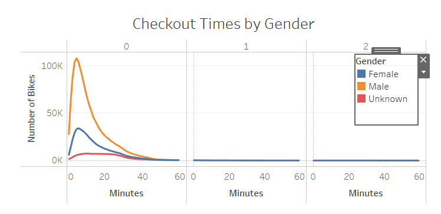

# Bike Sharing

### **Overview**

This project is a mock scenario in which to make a proposal for bike sharing idea for potential investor.
 The data analysis use data form [NYC CitiBike](https://www.citibikenyc.com/system-data) to understand how bike sharing business works in a city as NYC. Analyze trends and behavior related to bike sharing. From there create a proposal in how it might work in another city. **Tableau** was used to create visualizations of the data set for the presentation to convince investors that a bike-sharing program in Des Moines, Iowa is a solid business proposal.

### **Results**

[Link to Tabluea Story](https://public.tableau.com/shared/JWMFTGXJR?:display_count=n&:origin=viz_share_link)

[Link to Tabluea Workbook](https://public.tableau.com/views/NYC_Bikeshare/NYCBikeshareStory?:language=en-US&:display_count=n&:origin=viz_share_link)

**Results Analysis**

- Based on this bar chart the top riding hours during August in New York are 5:00 p.m to 7:00 p.m. So, bike maintenance could be better performed 2:00 a.m. to 5:00 a.m during least active riding times.

- In this graph we can look at the relationship between birth year and trip length. Looks like the later the birth year, the longer the ride duration. The general trend is that younger riders tend to use the bikes for longer periods of time.

- Bike Utilization

- Trips by Weekday per Hour

- Bike Repairs

- User Trips by Gender by Weekday

- Checkout Times by Gender

### **Summary**

In NYC bike sharing business is very popular and blooming. There was more than 2 million bike sharing ride during August 2019 Only. More of 1.5 million were male biker. The peak hours of bike sharing trips correlates with morning and evening business hours in workdays. This show that people would be willing to use biking not for just leisure but also as transportation mode once the right infrastructure is available. Which a great investment to any big city that looking for environmental and sustainable transportation solutions.

However, for investor to be willing to invest in such project more analysis would be needed. One month can&#39;t be enough to have a full picture. A data set the cover at least one year would give more insight about people behavior all year round regardless of weather conditions.

More insight could be drawn from understanding age of bikers if they are tourists or locals. Also, what is the average distance bikers are willing to bike to reach a destination, sorted by age and gender. The distribution of bike station around the city also has a big impact of people choosing to bike or no.

